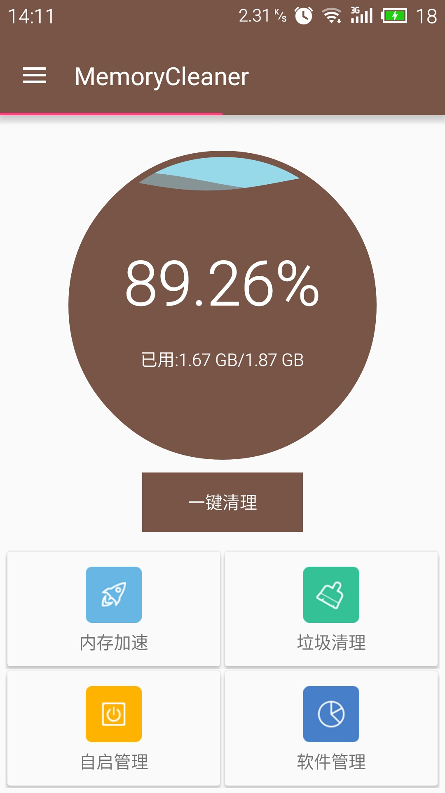
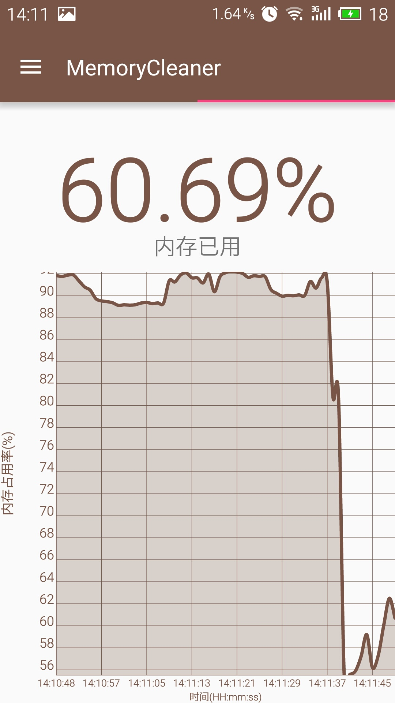
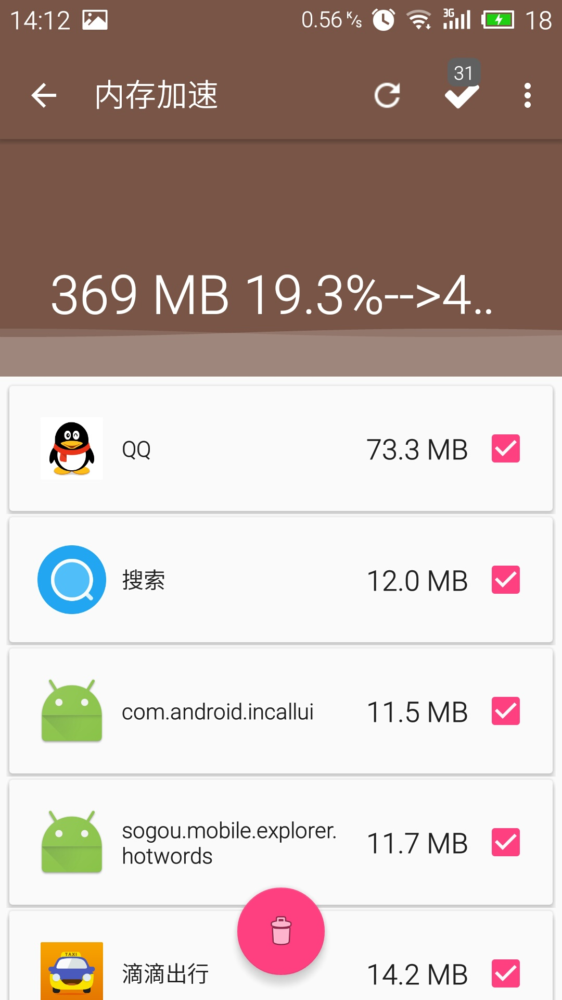
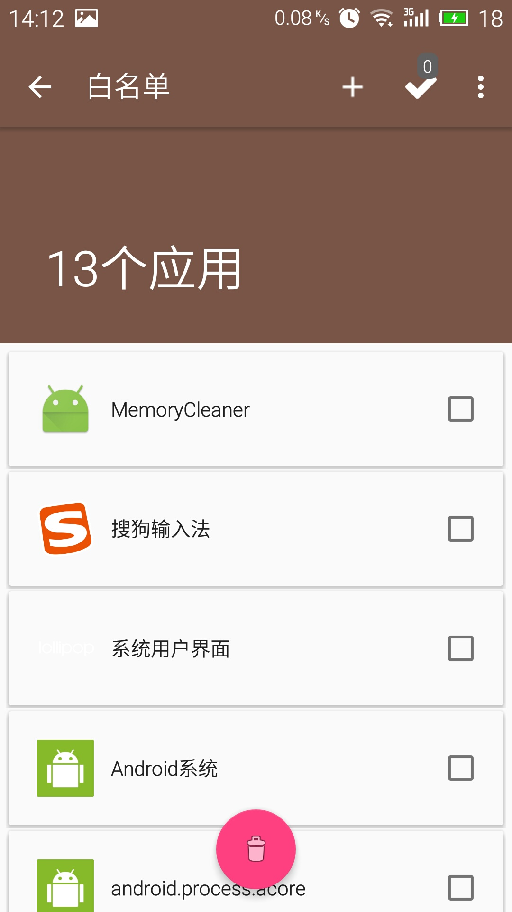
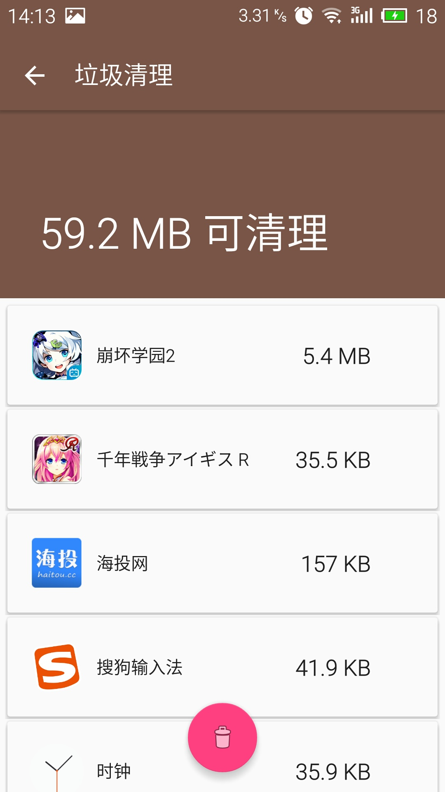
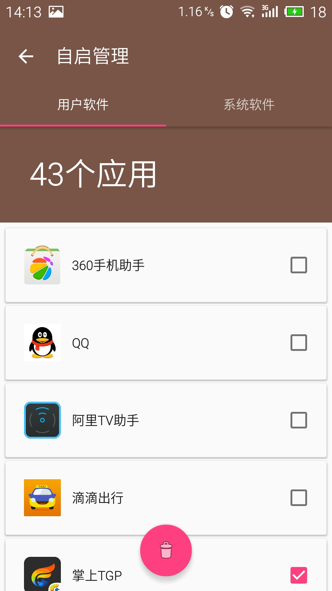
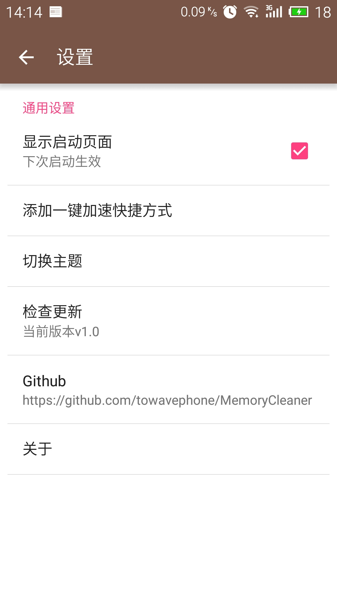

## MemoryCleaner
安卓手机内存清理 开源版，包括内存加速，垃圾清理，自启管理，软件管理等。   

## 说明
由于对第一版的安卓手机内存用到的技术以及UI不满意，同时第一版也有运行过程中易崩溃的BUG，故对第一版的[MemoryClean](https://github.com/towavephone/MemoryClean)进行改进，同时作为我的毕业设计，我基本满意此次用到的技术以及UI，大部分功能借鉴于[superCleanMaster](https://github.com/joyoyao/superCleanMaster)，UI借鉴于[Notes](https://github.com/lguipeng/Notes)，通过对这些项目的模仿开发出一款比较美观的安卓手机内存清理软件

## 基本功能
* 内存加速
* 垃圾清理
* 自启管理
* 软件管理
* 设备信息
* 白名单 

## 应用截图

 
 
 
 
 
 

## Open source projects
* [ButterKnife](http://jakewharton.github.io/butterknife/)   
* [WaveView](https://github.com/john990/WaveView) 
* [Dagger 2](https://github.com/google/dagger) 
* [RxAndroid](https://github.com/ReactiveX/RxAndroid) 
* [EventBus](https://github.com/greenrobot/EventBus) 
* [Stetho](https://github.com/facebook/stetho) 
* [LeakCanary](https://github.com/square/leakcanary) 
* [recycler-fast-scroll](https://github.com/plusCubed/recycler-fast-scroll) 
* [CircularFillableLoaders](https://github.com/lopspower/CircularFillableLoaders) 
* [hellocharts-android](https://github.com/lecho/hellocharts-android) 
* [SystemBarTint](https://github.com/jgilfelt/SystemBarTint) 
* [ActionItemBadge](https://github.com/mikepenz/Android-ActionItemBadge) 
* [MaterialPreference](https://github.com/jenzz/Android-MaterialPreference) 
* [Afinal](https://github.com/yangfuhai/afinal)

